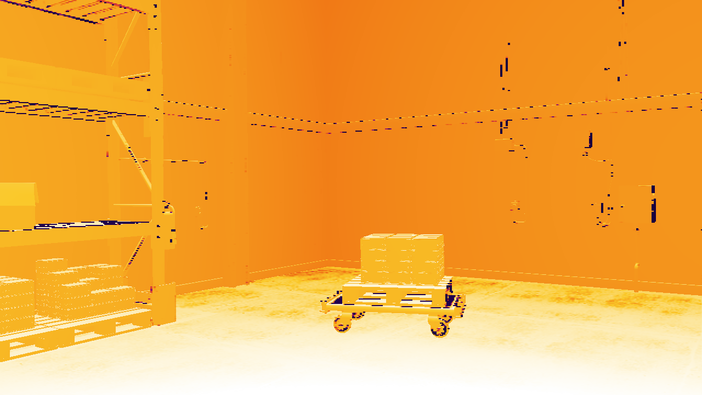
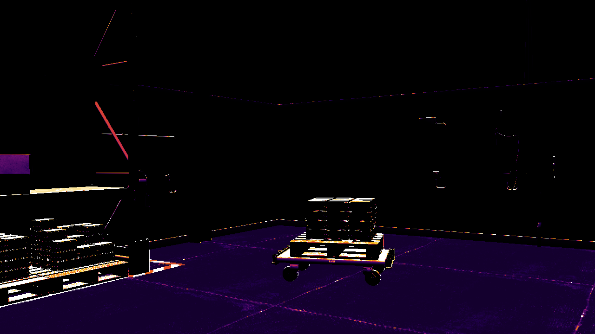
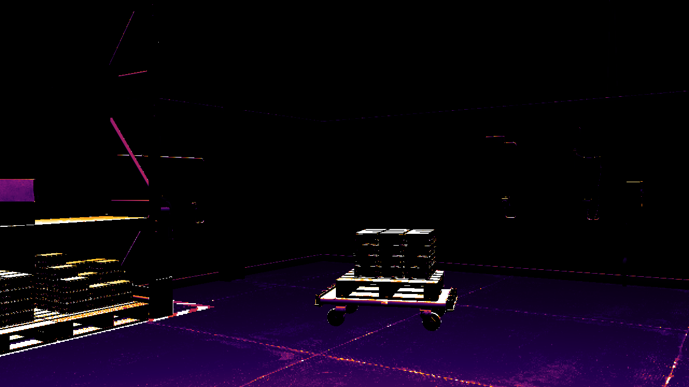
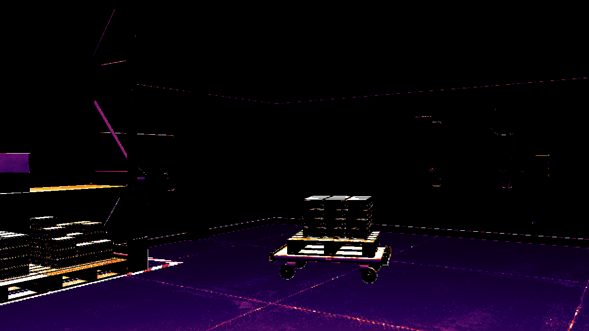
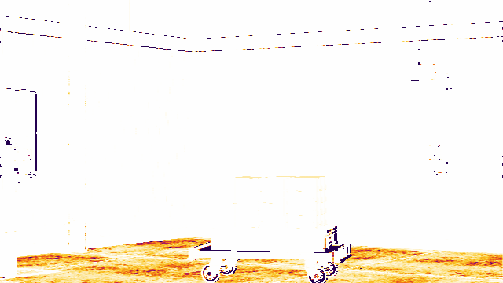

# Super Camera

Attempt to simulate infrared imagery for NVIDIA Isaac Sim / Omniverse.

This is an attempt, not a finished sensor model. It takes the buffers Isaac Sim
already renders (distance, normals, albedo, roughness, emissive, motion) and turns
them into IR-looking images for five spectral bands. The results are **far from
physically accurate** — there is no calibrated radiometry behind them, just simple
per-band heuristics that produce something that *looks* like the part of the
spectrum it is meant to represent. Treat the output as a rough stand-in, useful for
prototyping and as a starting point, not as ground truth.

It runs two ways: as an Isaac Sim extension with a GUI panel, and as a standalone
Python library you can drop into a loop like Isaac Lab.

<p align="center">
  
  <br><em>LWIR output with the ironbow palette.</em>
</p>

## The five bands

The same warehouse scene through each band. All are colorized with the ironbow
palette, so brighter (yellow/white) means more signal.

| VIS | NIR_ACTIVE | SWIR_ACTIVE |
|---|---|---|
|  |  |  |
| 400–700 nm, reflective | 700–1000 nm, reflective | 1000–2500 nm, reflective |

| MWIR | LWIR |
|---|---|
|  |  |
| 3000–5000 nm, emissive | 8000–14000 nm, emissive |

## Install

```bash
git clone https://github.com/tusqui3/super_camera.git
```

**As an Isaac Sim extension:** in Isaac Sim open
**Window → Extensions → ⚙ → Add path**, point it at `/path/to/super_camera/exts`,
then search for **Super Camera** and enable it. The panel opens on its own.

**As a library:** add the package to your path and run with Isaac Sim's Python.

```bash
export PYTHONPATH="$PYTHONPATH:/path/to/super_camera/exts/super.camera"
python standalone/example.py
```

No Isaac Sim install? `standalone/example_mock.py` runs on numpy alone.

## Quick start

```python
from super.camera import SuperCamera, BufferType

camera = SuperCamera(
    prim_path="/World/SuperCamera",
    resolution=(1280, 720),
    buffers=[BufferType.DISTANCE_TO_OBJECT, BufferType.NORMALS],
)

camera.aim(position=(0, -5, 2), target=(0, 0, 0))   # Z-up world

ir = camera.synthesize_ir(mode="LWIR")              # float32 (H, W) in [0, 1]

from PIL import Image
Image.fromarray(SuperCamera.colorize(ir, "ironbow")).save("ir_LWIR.png")
```

`synthesize_ir(mode, ambient_temp=293.0)` returns a float32 `(H, W)` array in
`[0, 1]`, already normalized and noise-free. The mode is a band name
(case-insensitive). Buffers a band needs are attached automatically on the first
call. Background pixels (rays that hit nothing) come back as `0`.

Keep the raw float map for training; only run it through `colorize()` when you want
to look at it.

## Spectral bands

Five bands, split into two groups by how they get their signal.

**Reflective** bands see light bouncing off surfaces. Brightness comes from how
reflective the surface is (albedo, specular, roughness, facing angle). The two
active ones assume the light sits at the camera, so far surfaces look dimmer
(inverse-square falloff).

| Band | Range | How it's built |
|---|---|---|
| `VIS` | 400–700 nm | Ambient color reflectance. No distance falloff. |
| `NIR_ACTIVE` | 700–1000 nm | Like VIS with a stronger specular glint, divided by distance². |
| `SWIR_ACTIVE` | 1000–2500 nm | Like NIR but color-blind, even stronger specular. |

**Emissive** bands treat the surface itself as the source. Signal comes from
emissivity and temperature — there is no distance falloff. Temperature is a proxy
built from `ambient_temp`, emissive materials, and motion.

| Band | Range | How it's built |
|---|---|---|
| `MWIR` | 3000–5000 nm | `ε · T⁴`. The fourth power makes hot spots dominate. |
| `LWIR` | 8000–14000 nm | `ε · T`. Roughly linear, so the whole scene glows. |

So a smooth metal plate glints in the active bands but stays dark in LWIR (low
emissivity), a warm matte object barely shows under active NIR but is bright in
LWIR, and only something genuinely hot or moving stands out in MWIR.

`ambient_temp` (Kelvin) only affects the emissive bands. The canonical definitions
live in `SPECTRAL_BANDS` in
[`buffers.py`](exts/super.camera/super/camera/buffers.py).

```python
ir = camera.synthesize_ir("LWIR")                     # thermal
ir = camera.synthesize_ir("MWIR", ambient_temp=300.0) # hot-biased
ir = camera.synthesize_ir("NIR_ACTIVE")               # active reflective
ir = camera.synthesize_ir("VIS")                      # visible reflectance
```

The old names `thermal` (→ `LWIR`) and `active_nir` (→ `NIR_ACTIVE`) still work but
are deprecated and print a one-time notice.

## Colormap

```python
rgb = SuperCamera.colorize(ir, "ironbow")    # default, thermal-camera look
rgb = SuperCamera.colorize(ir, "grayscale")
rgb = SuperCamera.colorize(ir, "jet")
```

`colorize()` maps any `[0, 1]` float `(H, W)` map to a uint8 `(H, W, 3)` image. The
ironbow palette is a fixed lookup table set by `_IRONBOW_STOPS` in
[`super_camera.py`](exts/super.camera/super/camera/super_camera.py) — edit the stops
to retune the look.

## Writing your own band model

Each band is one method on `SuperCamera`: `_synth_vis`, `_synth_nir_active`,
`_synth_swir_active`, `_synth_mwir`, `_synth_lwir`. Each gets the per-pixel buffers
(already cleaned of NaN/Inf) and the facing term `dot_n_v`, and returns a
non-negative `(H, W)` array. The rest — masking background, normalizing to
`[0, 1]` — is handled for you.

To tweak a band, edit its method or the tuning constants at the top of the file.
To add one:

1. Add a `SpectralBand` to `SPECTRAL_BANDS` in `buffers.py`.
2. List its buffers in `_BAND_BUFFERS` in `super_camera.py`.
3. Add a `_synth_<band>` method and a branch in the dispatcher.

```python
def _synth_myband(self, bufs, dot_n_v):
    return np.mean(bufs["EMISSIVE"][:, :, :3], axis=2) * dot_n_v
```

`DISTANCE_TO_OBJECT` and `NORMALS` are always available; guard anything else (some
builds lack `EMISSIVE`) with `if "EMISSIVE" in bufs`.

## Isaac Lab integration

Isaac Lab already steps the renderer, so don't let Super Camera step it too. Use
the no-step read path: attach the band's buffers up front, then read each frame.

```python
camera = SuperCamera(
    prim_path="/World/SuperCamera",
    resolution=(640, 480),
    buffers=[
        BufferType.DISTANCE_TO_OBJECT, BufferType.NORMALS,
        BufferType.DIFFUSE_ALBEDO, BufferType.SPECULAR_ALBEDO, BufferType.ROUGHNESS,
        BufferType.EMISSIVE, BufferType.MOTION_VECTORS,
    ],
)
camera.aim(position=(3, 0, 2), target=(0, 0, 0.5))

for step in range(num_steps):
    sim.step(render=True)                            # Isaac Lab renders
    ir = camera.synthesize_ir_from_render("LWIR")    # reads it, no extra step
```

| Method | Steps the renderer? | Use from |
|---|---|---|
| `synthesize_ir()` / `capture()` | yes (sync) | `standalone/example.py` |
| `synthesize_ir_async()` / `capture_async()` | yes (async) | the extension GUI |
| `synthesize_ir_from_render()` / `read()` | no | Isaac Lab, any external loop |

Super Camera uses its own render product and never touches the active viewport, so
it coexists with Isaac Lab's sensors. Full example:
[`standalone/isaaclab_integration.py`](standalone/isaaclab_integration.py).

## GUI panel

The panel opens automatically when the extension loads. Set the prim path and
resolution, create the camera, pick a band, and capture. The IR preview updates
after each frame and the result is saved as a PNG.

<p align="center">
  
  <br><em>The extension running in Isaac Sim.</em>
</p>

| Section | Controls |
|---|---|
| Camera Setup | Prim path, width × height, Create Camera, Open Viewport |
| Spectral Band | Band dropdown with wavelength + description; Ambient Temp for emissive bands |
| IR Preview | Live ironbow thumbnail after each capture |
| Output | Save path for the PNG |
| Buttons | Capture IR Frame, Reset Camera |

## Buffer reference

Add a buffer at construction (`buffers=[...]`) or at runtime
(`camera.add_buffer(BufferType.X)`).

Pixel buffers — `get_data()` returns an `np.ndarray`:

| BufferType | Annotator | Shape | dtype |
|---|---|---|---|
| `DISTANCE_TO_OBJECT` | `distance_to_camera` | `(H,W)` | float32 |
| `DEPTH` | `distance_to_image_plane` | `(H,W)` | float32 |
| `NORMALS` | `normals` | `(H,W,4)` | float32 |
| `RGB` | `rgb` | `(H,W,4)` | uint8 |
| `DIFFUSE_ALBEDO` | `DiffuseAlbedo` | `(H,W,4)` | float |
| `SPECULAR_ALBEDO` | `SpecularAlbedo` | `(H,W,4)` | float |
| `ROUGHNESS` | `Roughness` | `(H,W[,C])` | float |
| `EMISSIVE` | `EmissionAndForegroundMask` | `(H,W,4)` | float |
| `MOTION_VECTORS` | `motion_vectors` | `(H,W,4)` | float32 |

The PBR material AOVs use CamelCase names on Kit 107.x; older lowercase names are
kept as fallbacks and tried automatically.

Structured buffers — `get_data()` returns a `dict`:

| BufferType | Annotator | Notes |
|---|---|---|
| `SEMANTIC` | `semantic_segmentation` | `(H,W)` uint32 + `idToLabels` |
| `INSTANCE` | `instance_segmentation` | hierarchical instance ids |
| `INSTANCE_ID` | `instance_id_segmentation` | per-leaf-prim ids |
| `OCCLUSION` | `occlusion` | per-instance occlusion ratio |
| `BBOX_2D_TIGHT` | `bounding_box_2d_tight` | tight 2-D boxes |
| `BBOX_2D_LOOSE` | `bounding_box_2d_loose` | loose 2-D boxes |
| `BBOX_3D` | `bounding_box_3d` | 3-D boxes + world pose |
| `CAMERA_PARAMS` | `camera_params` | intrinsics / extrinsics |
| `POINTCLOUD` | `pointcloud` | `(N,3)` world-space points |
| `SKELETON` | `skeleton_data` | joint positions |

## Mock mode

With no Omniverse install, every buffer returns zero-filled arrays of the right
shape — handy for CI and logic work. Auto-enabled when `omni.replicator.core`
can't be imported.

```python
camera = SuperCamera(mock=True, buffers=[BufferType.DISTANCE_TO_OBJECT])
ir = camera.synthesize_ir("LWIR")
```

```bash
python standalone/example_mock.py
```

## Project structure

```
super_camera/
├── CLAUDE.md                           ← development notes
├── buffers.py                          ← root copy (kept identical to ext)
├── super_camera.py                     ← root copy (kept identical to ext)
├── exts/
│   └── super.camera/
│       ├── config/extension.toml
│       └── super/camera/
│           ├── __init__.py             ← re-exports SuperCameraExtension
│           ├── buffers.py              ← BufferType / BufferData / SPECTRAL_BANDS
│           ├── super_camera.py         ← SuperCamera class + colormaps
│           └── extension.py            ← GUI + Omniverse lifecycle
└── standalone/
    ├── example.py                      ← full Isaac Sim example
    ├── example_mock.py                 ← numpy-only, no Isaac Sim
    └── isaaclab_integration.py         ← Isaac Lab sim-loop example
```

## Requirements

- NVIDIA Isaac Sim 4.x / Omniverse Kit 106.x for live capture
- Python 3.10+
- `numpy`, plus `Pillow` for PNG output

Mock mode only needs `numpy`.
